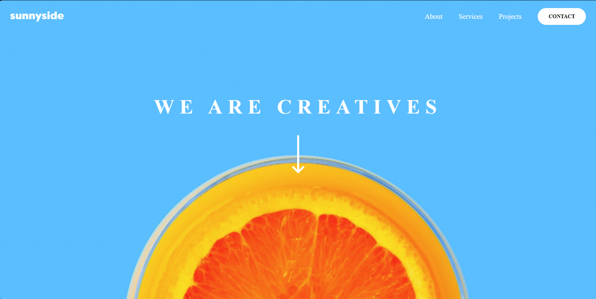

# Frontend Mentor - Sunnyside agency landing page solution

This is a solution to the [Sunnyside agency landing page challenge on Frontend Mentor](https://www.frontendmentor.io/challenges/sunnyside-agency-landing-page-7yVs3B6ef). Frontend Mentor challenges help you improve your coding skills by building realistic projects.

## Table of contents

- [Overview](#overview)
  - [The challenge](#the-challenge)
  - [Links](#links)
- [My process](#my-process)
  - [Built with](#built-with)
  - [Screenshot](#screenshot)

## Overview

### The challenge

Users should be able to:

- View the optimal layout for the site depending on their device's screen size
- See hover states for all interactive elements on the page

### Links

- Solution URL: https://www.frontendmentor.io/solutions/sunnyside-agency-landing-page-html-css-javascript-SuM2HTsY2Z
- Live Site URL: https://sunnyside-agency-landing-page-rafael.netlify.app

## My process

### Built with

- Semantic HTML5 markup
- CSS custom properties
- Flexbox
- CSS Grid
- Mobile-first workflow

### Screenshot

  - Desktop
  
    
    
     
     
     
    
  - Mobile
  
    
